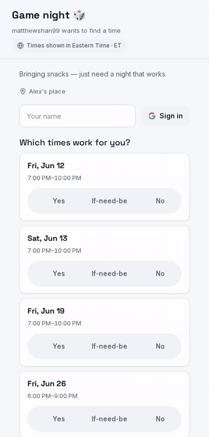
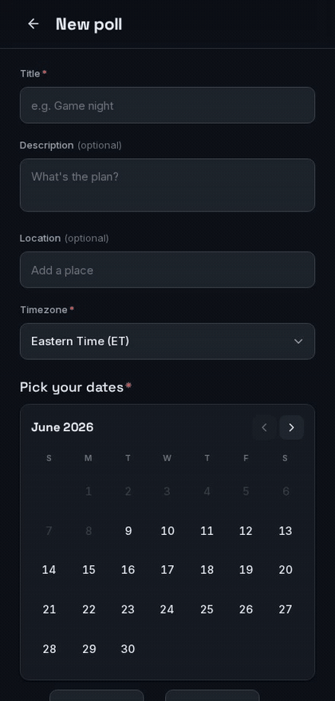

# Context engineering — visual capture of front-end work

A short, repeatable workflow for turning a front-end flow into an **optimized GIF**
that lives next to the code and the plans. We treat these GIFs as *context*, not
decoration: a recording of the real rendered flow is denser and higher-signal
than prose for the people (and agents) who pick up the work next.

## Why GIFs are good context

- **They prove the flow works** end to end against the real app + DB, not a mock.
- **They show the design bundle was matched** — reviewers can eyeball the result
  against `docs/design/Herd Scheduler/screenshots/` without checking out the branch.
- **They're cheap to refresh.** Because capture is scripted (not hand-recorded),
  re-running it after a change is one command, so the media never goes stale.
- **They compress a lot of state** — typing, calendar multi-select, the sticky
  time range, the success screen — into a few hundred KB an agent can be pointed at.

The same idea as a written spec: invest a little to make the *next* read cheap.

## What's in the repo

| Piece | Path |
|-------|------|
| Capture driver (Playwright → ffmpeg) | `tests/visual/capture.mts` |
| Run script | `pnpm capture:visual` |
| Output GIFs (per phase) | `docs/screenshots/phase-<n>/*.gif` |
| Operational checklist (Claude Code skill) | `.claude/skills/visual-capture/` (`/visual-capture`) |

> This page is the rationale and reference. The step-by-step run/add-a-scenario
> checklist is also packaged as the **`/visual-capture`** skill so it's invocable
> in Claude Code.

## The pipeline

```
Playwright drives the real app  ──►  records each scenario to .webm
        (dev-login bypass)                       │
                                                 ▼
                              ffmpeg: palettegen + paletteuse  ──►  small, sharp .gif
```

1. **Playwright** opens a phone-sized context (440×920 @2x), authenticates via the
   dev-login bypass, and drives a scenario with realistic pacing (`pressSequentially`,
   short `waitForTimeout`s) so the motion reads well.
2. Each scenario records to its own `.webm` in a scratch dir.
3. **ffmpeg** converts each webm to a GIF using a generated palette
   (`palettegen` + `paletteuse`), downscaled to 420px wide at 13 fps — the knobs
   that keep the file small without smearing the type.

### Authentication: the dev-login bypass

Capture never does the Google round-trip. It hits
`GET /api/dev/login?email=<owner>&callbackUrl=/create`, which mints a session
cookie directly (see CLAUDE.md → "Local auth testing"). The owner email always
passes `requireCreator`, so the create flow is reachable. This is the same
triple-gated, dev-only route used for manual testing — never enabled in prod.

## Running it

Prerequisites:

- **ffmpeg** on `PATH` (`ffmpeg -version`).
- **Chromium for Playwright**: `npx playwright install chromium` (one-time).
- The app running against a migrated Postgres, with the dev-login enabled:

```bash
docker compose up -d                 # local Postgres only
pnpm migrate:deploy && pnpm db:seed  # schema + owner bootstrap
ENABLE_DEV_LOGIN=true pnpm dev       # app on :3000
```

Then, in another shell:

```bash
pnpm capture:visual                  # writes docs/screenshots/phase-5/*.gif
```

Override the target with `CAPTURE_BASE_URL` / `OWNER_EMAIL` if needed. Tear the
DB down when done (`docker compose down`) — we don't leave containers running.

## Adding a scenario (per phase)

In `tests/visual/capture.mts`, add a `record(browser, "<name>", "<light|dark>", fn)`
call inside `main()`. The `fn(page)` receives a fresh authenticated page; drive it
with role/label locators (they double as accessibility assertions) and small waits.
Point new output at `docs/screenshots/phase-<n>/` by changing `OUT_DIR`.

Conventions:

- **Name by screen/flow**, kebab-case: `create-flow`, `poll-page`, `create-dark`.
- **One flow per GIF.** A dark-mode pass is a separate, shorter scenario.
- **Drive by role/label, not CSS** — it stays robust as classes change and exercises
  the same a11y surface a screen reader would.

## Phase 5 — create + share flow

The full create flow: fill the poll, multi-select days on the calendar, tile a
shared time range (sticky for the next add), toggle anonymity, publish, and copy
the share link.


The shareable `/p/{slug}` page the link resolves to (Phase 6 adds voting here):



The create form in dark mode:


